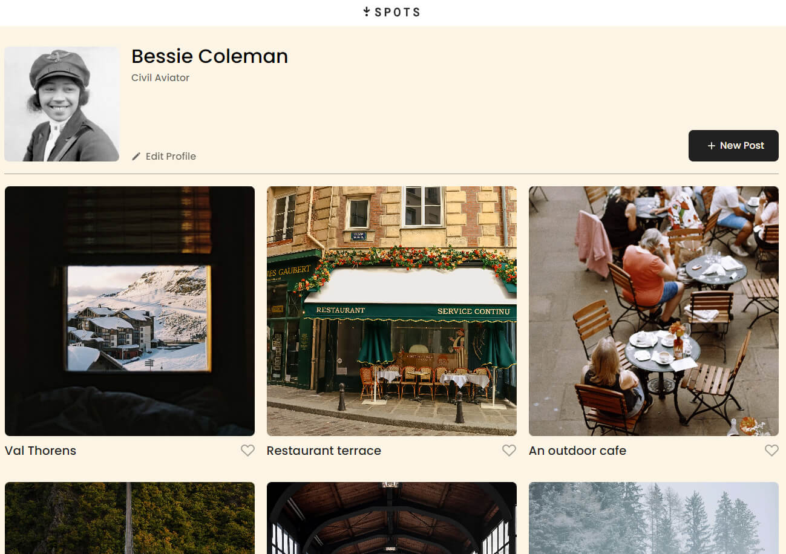
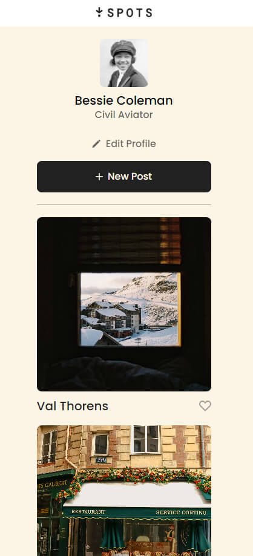

# Project 3: Spots

### Overview  

* Intro
* Technologies / Techniques  
* Figma  
* Images
* Live Site
  
**Intro**
  
Spots is a website designed to showcase art gallery pieces. Spots uses dynamic responsiveness to allow the art pieces to be visible smoothly across desktop and mobile devices.

**Technologies / Techniques**

* Using a combination of Flexbox and Grid, I was able to style the Profile Section and Card Section as seen below. 
* Media Queries were used to allow smooth experiences on both desktop and mobile devices.
* This project also follows BEM methodology to structure my files and CSS code neatly. 
* Google Fonts were imported into this project, specifically Poppins font face.
* Figma was used as the blueprint for designing this website. See the link to the figma project below!
  
**Figma**  
  
* [Link to the project on Figma](https://www.figma.com/file/BBNm2bC3lj8QQMHlnqRsga/Sprint-3-Project-%E2%80%94-Spots?type=design&node-id=2%3A60&mode=design&t=afgNFybdorZO6cQo-1)
  
**Images**  

  
**[View Spots Live!](https://mofesdo.github.io/se_project_spots/)**

Thanks for checking out Spots!

[Short Video Explaining Spots](https://drive.google.com/file/d/1wSu62cfxa0K8ZcLM2LhbFp0pniUaHRMj/view?usp=sharing)
